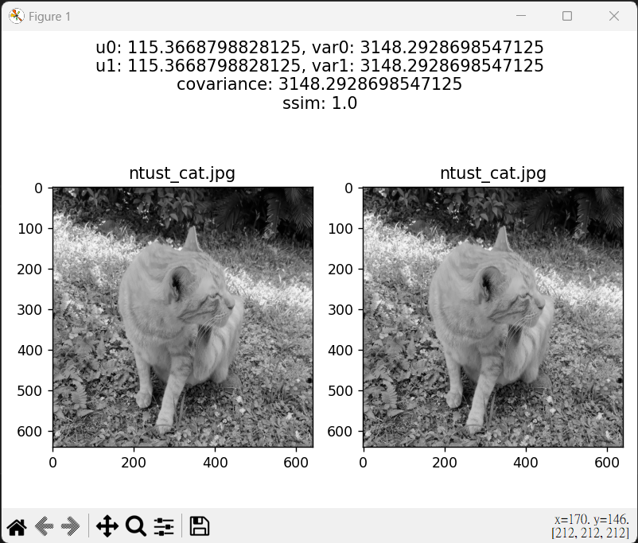
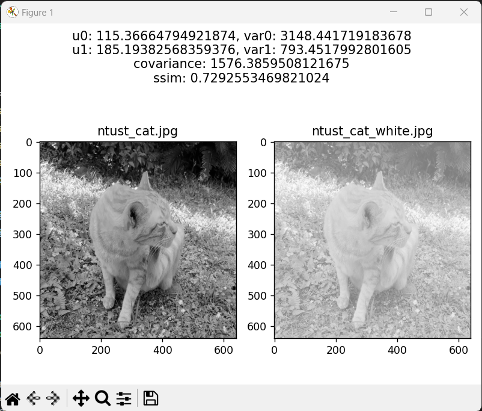

# ADSP HW4

## SSIM

## Environment
- python 3.10
- numpy
- opencv-python
- opencv-contrib-python
- matplotlib
- argparse

## Run Code
```
python main.py --input_img0 {path/to/img0} --input_img1 {path/to/img1} --c1 {c1} --c2 {c2}
```

## Results
example 1:
```
python main.py --input_img0 ntust_cat.jpg --input_img1 ntust_cat.jpg
```

example 2:
```
python main.py --input_img0 ntust_cat.jpg --input_img1 ntust_cat_white.jpg
```
